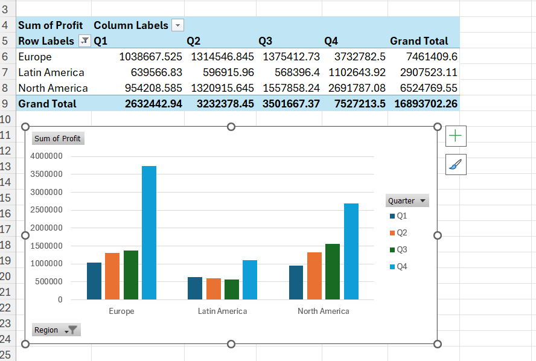

# Data Analytics Portfolio

Welcome to my professional data analytics portfolio. Having a background in Computer Science, I focus on applying structured, programmatic logic to relational data modeling and business analysis.

---

## Project 1: Global Sales & Profitability Analysis (Excel)

This project analyzes a dataset containing 700 rows of global sales data across multiple countries, segments, products, and dates to identify regional profitability trends.

### 📊 Project Architecture
*   **Data Source:** Connected directly to the Microsoft Financials live CSV via **Power Query** to ensure automated data cleaning and updates.
*   **Storage Model:** Extracted raw data into an **Excel Structured Table** to maintain formula stability and dynamic cell referencing.

### ⚙️ Technical Skills & Logic Showcased
*   **Advanced Logic:** Used `SWITCH(TRUE(), ...)` as a scalable alternative to nested `IF` statements to map five unique countries into three distinct geographic regions.
*   **Date Intelligence:** Constructed an `IFS` logic sequence based on the month number to dynamically group sales rows into standard quarters (`Q1`-`Q4`).
*   **Data Integrity & Error Safety:** Implemented `IFERROR()` boundary calculations on profitability divisions (`Profit / Sales`) to prevent dividing-by-zero errors.
*   **Aggregations & Validation:** Wrote `SUMIFS` and `COUNTIFS` formulas to aggregate gross revenue, net units sold, and loss transactions.
*   **Visual Analysis:** Created a dynamic **Pivot Table** and corresponding **Clustered Column Chart** to analyze the sum of profit across regions and quarters.

---

## Project Changelog & Progress Log

### Step 1: Power Query & Table Setup
*   Established connection to Microsoft’s global financials repository.
*   Cleaned and loaded 700 records into a structured Excel table named `financials`.

### Step 2: Regional & Quarterly Mapping
*   **Formula (Region Column):**
    `=SWITCH(TRUE(), OR(\\\[@Country]="Canada", \\\[@Country]="US"), "North America", OR(\\\[@Country]="France", \\\[@Country]="Germany"), "Europe", "Latin America")`
*   **Formula (Quarter Column):**
    `=IFS(\\\[@Month\\\_Number]<=3, "Q1", \\\[@Month\\\_Number]<=6, "Q2", \\\[@Month\\\_Number]<=9, "Q3", \\\[@Month\\\_Number]<=12, "Q4")`

### Step 3: Profit Margin Calculation
*   **Formula (Profit Margin Column):**
    `=IFERROR(\\\[@Profit]/\\\[@Sales], 0)`

### Step 4: Aggregate Formula Verification
*   **Total Units Sold (Gov / North America):** `185,119`
    `=SUMIFS(financials\\\[Units\\\_Sold], financials\\\[Segment], "Government", financials\\\[Region], "North America")`
*   **Total Loss Transactions (Profit <= 0):** `63`
    `=COUNTIFS(financials\\\[Profit], "<=0")`

### Step 5: Visual Dashboard Construction
*   Built a Pivot Table to group total profit by region and quarters.
*   Constructed a column chart visualizing quarterly performance across Europe, Latin America, and North America.

## Pivot Table Image

