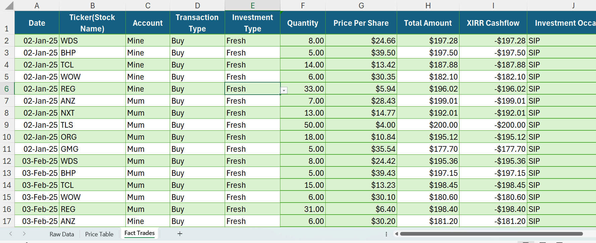
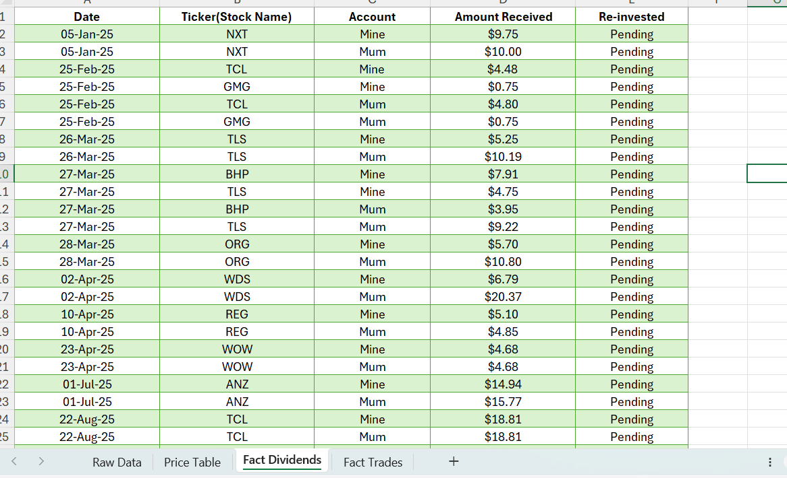

# Data Analytics Portfolio

Welcome to my professional data analytics portfolio. I focus on applying clean, structured logic to relational data modeling and business analysis.

---

## Project 3: ASX Stock Tracker and Analysis (Excel)

This project analyzes a transactional dataset containing stock trades on the Australian Securities Exchange (ASX).

---

## Section 1: Project Overview (Written By Me)

### Step 1: How the "Fact Trades" Sheet Works

*   **Columns in this table:** Date, Ticker, Account, Transaction Type, Investment Type, Quantity, Price Per Share, Total Amount, XIRR Cashflow, Investment Occasion.

*   **Data Validation (Dropdown lists):**
    *   To prevent spelling mistakes, dropdown menus are used to select the `Account`, `Transaction Type`, `Investment Type`, and `Investment Occasion`.
    *   `Quantity` must be at least 1 unit.
    *   `Ticker` can be a maximum of 6 characters.

*   **Formulas Used:**
    1.  **Total Amount:** `=IF(A2="", "", F2*G2)`
        *   *Explanation:* If the Date cell is empty, it does not calculate. Otherwise, it multiplies Quantity (Column F) by Price Per Share (Column G).
    2.  **XIRR Cashflow:** `=IFS(E2="Dividend", 0, AND(D2="Buy", E2="Fresh"), -H2, AND(D2="Sell", E2="Fresh"), H2, TRUE, "")`
        *   *Explanation:* This counts the cash flow only when we buy stocks using fresh money (which is recorded as a negative value, `-H2`). If we are using money from dividends or existing stock sales to buy stocks, we do not count it here.

*   **About the Data:**
    *   *Note: This data is for practice only. These are not stock recommendations.*
    *   I created a 161-row dataset starting from 2025 across 10 random ASX stocks. 
    *   I used Google Sheets and the `=GOOGLEFINANCE` function to get the historical opening stock prices for those dates.
    *   I connected the Google Sheet to Excel to pull the prices using an `XLOOKUP` formula.

#### Fact Trades Table


---

### Step 2: How the "Fact Dividends" Sheet Works

*   **Columns in this table:** Date, Ticker, Account, Amount Received, Re-invested.

*   **Data Validation (Dropdown lists):**
    *   The user must pick values from lists for `Account` (Mine/Mum) and `Re-invested` (Pending/Deployed) so there are no spelling mistakes.

*   **About the Data:**
    *   *Note: This data is for practice only. These are not stock recommendations.*
    *   I used Google Sheets to calculate the exact share quantity we were holding prior to each dividend payment date, then calculated the exact dividend deposit based on historical dividend-per-share rates.

#### Fact Dividends Table


---

### Step 3: How the "Dim Calendar" Sheet Works

*   **Columns in this table:** Date, Year, Month Number, Month Name, Quarter.

*   **How it was created:**
    *   Instead of typing dates manually on a sheet, I used Excel's **Power Query** to automatically generate a complete calendar for the years 2025 and 2026.
    *   This table acts as our master date list, allowing us to cleanly link dates from our trades sheet and dividends sheet together.

---

## Section 2: Technical Reference & AI Collaboration (Generated with AI)

### Step 1: Fact Trades Table Setup & Architecture

To maintain a clean transactional ledger, I established the first "Fact" table, named `Fact_Trades`, to track historical transactions.

*   **Table Schema:** `Date`, `Ticker`, `Account`, `Transaction Type`, `Investment Type`, `Quantity`, `Price Per Share`, `Total Amount`, `XIRR Cashflow`, `Investment Occasion`.
*   **Data Integrity & Validation:** 
    *   Enforced list-based validation on `Account` (Mine/Mum), `Transaction Type` (Buy/Sell), `Investment Type` (Fresh/Dividend), and `Investment Occasion` (SIP/Tactical) to eliminate manual entry errors.
    *   Constrained the `Quantity` column to accept only positive integers ($\ge 1$).
    *   Limited `Ticker` inputs to a maximum of 6 characters to align with standard exchange formats.

*   **Calculated Column Formulas:**
    1.  **Total Amount:** Calculated dynamically to prevent empty-row processing:
        ```excel
        =IF([@Date]="", "", [@Quantity] * [@[Price Per Share]])
        ```
    2.  **XIRR Cashflow:** Constructed conditional logic to isolate true capital injections. If the trade uses reinvested dividends, it is excluded from the cash flow calculation. Only fresh capital buys (negative flow) or capital withdrawals (positive flow) are recorded:
        ```excel
        =IFS([@[Investment Type]]="Dividend", 0, AND([@[Transaction Type]]="Buy", [@[Investment Type]]="Fresh"), -[@[Total Amount]], AND([@[Transaction Type]]="Sell", [@[Investment Type]]="Fresh"), [@[Total Amount]], TRUE, "")
        ```

*   **Data Sourcing & Workaround Pipeline:**
    *   To quickly generate a realistic, 161-row backtest starting from 2025 across 10 ASX tickers, I constructed a data pipeline between Excel and Google Sheets.
    *   Using Google Sheets' `=GOOGLEFINANCE` function, I fetched historical opening prices for specific monthly dates.
    *   I imported these clean price tables into Excel via a Data Connection, using `XLOOKUP` to match dates and tickers to calculate the exact quantities purchased per monthly $200 SIP allocation.

---

### Step 2: Fact Dividends Table Setup & Asset Tracking

To track cash inflows from company distributions, I established the second transactional table, named `Fact_Dividends`.

*   **Table Schema:** `Date`, `Ticker`, `Account`, `Amount Received`, `Re-invested`.
*   **Data Integrity & Validation:**
    *   Enforced list-based validation on `Account` (Mine/Mum) to separate holdings.
    *   Created a custom status validation list for the `Re-invested` column using `"Pending"` and `"Deployed"` parameters.
    *   Formatted `Amount Received` as Currency for numerical consistency.

*   **Portfolio Cash Management Logic:**
    *   ASX brokerages often require a minimum trade amount of $500, meaning small dividend payouts cannot be reinvested immediately.
    *   The `Re-invested` status tracks these fractional payouts. Keeping them as `"Pending"` allows the model to calculate the exact "dividend pool balance" currently sitting as cash in the bank account. Once the pool reaches an investable threshold and is deployed to buy shares on the Trades sheet, the status is updated to `"Deployed"`.

*   **Data Sourcing & Calculations:**
    *   I used the trade history from `Fact_Trades` to determine the exact stock quantities held prior to each ex-dividend/payment date.
    *   By referencing historical dividend-per-share payout data, I calculated the exact `Amount Received` for each stock across both accounts.

---

### Step 3: Dim_Calendar Table Generation via Power Query

To support time-intelligence analysis and establish a clean Star Schema, I generated a dedicated lookup table named `Dim_Calendar` using Power Query. 

*   **Relationship Architecture:** This table covers a continuous range from `2025-01-01` to `2026-12-31`. It establishes a Many-to-One ($\star \rightarrow 1$) relationship with the transaction dates in both `Fact_Trades` and `Fact_Dividends`.
*   **M-Code Script:**
    ```powerquery
    let
        StartDate = #date(2025, 1, 1),
        EndDate = #date(2026, 12, 31),
        NumberOfDays = Duration.Days(EndDate - StartDate) + 1,
        DateList = List.Dates(StartDate, NumberOfDays, #duration(1, 0, 0, 0)),
        #"Converted to Table" = Table.FromList(DateList, Splitter.SplitByNothing(), null, null, ExtraValues.Error),
        #"Renamed Columns" = Table.RenameColumns(#"Converted to Table",{{"Column1", "Date"}}),
        #"Changed Type" = Table.TransformColumnTypes(#"Renamed Columns",{{"Date", type date}}),
        #"Added Year" = Table.AddColumn(#"Changed Type", "Year", each Date.Year([Date]), Int64.Type),
        #"Added Month Number" = Table.AddColumn(#"Added Year", "Month Number", each Date.Month([Date]), Int64.Type),
        #"Added Month Name" = Table.AddColumn(#"Added Month Number", "Month Name", each Date.MonthName([Date]), type text),
        #"Added Quarter" = Table.AddColumn(#"Added Month Name", "Quarter", each "Q" & Text.From(Date.QuarterOfYear([Date])), type text)
    in
        #"Added Quarter"
    ```